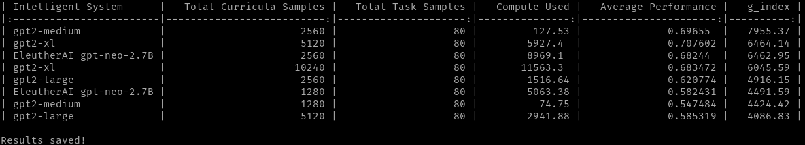

[](https://mybinder.org/v2/gh/mayahq/g-index-benchmark/HEAD?filepath=notebooks%2Freference.ipynb)
[](https://colab.research.google.com/github/mayahq/g-index-benchmark/blob/master/notebooks/reference.ipynb)

# Towards a Measure of General Intelligence
* [Introduction](#Introduction)
* [Repository Structure](#RepositoryStructure)
* [Usage](#Usage)
	* [Setup](#Setup)
	* [Using the CLI](#UsingtheCLI)
		* [Parameters](#Parameters)
		* [Values Returned](#ValuesReturned)
		* [Example](#Example)
* [Dataset](#Dataset)
* [Disclaimer](#Disclaimer)
* [Results](#Results)
* [License](#License)
* [Request the data](#Requestthedata)
* [Get Help](#GetHelp)
* [Citing Details](#CitingDetails)


## <a name='Introduction'></a>Introduction

This repository contains the code to measure `g-index` for an experiment as described in the [paper](https://arxiv.org/abs/2109.12075)

## <a name='RepositoryStructure'></a>Repository Structure 

|     | Asset Name       | Description  |
| --- | ------------     | ------------ |
| 1.  | domains/         | Contains DAG files for various domains. For more information on domains see [Domain Details](#dataset)      |
| 2.  | experiments/     | Contains experiment files for experiments mentioned in [Results](#results)   |
| 3.  | notebooks/       | Contains Tutorial Notebooks for reproducing mentioned in the [paper](https://arxiv.org/abs/2109.12075) results & running simulations on `g-index` |
| 4.  | results/         | Output directory for CLI mentioned in [CLI Usage](#usage)                    |
| 5.  | g_index.py       | Python File for Calculating `g-index` for experiments and for running simulations. For more info see [Tutorial Notebook](notebooks/reference.ipynb)
| 6.  | definitions<span>.</span>md       | Contains definitions for various parameters used in `g-index` calculations.

## <a name='Usage'></a>Usage 
### NOTE: 
Some of the package requirements fail to get install on <em>Arm based M1 macs</em>, please use binder/colab to launch the notebooks.
### <a name='Setup'></a>Setup 
1. Create a conda environment from the provided `env.yml` with the following command

```bash
    conda env create -f env.yml
```

2. Alternatively you can also install the required packages  in your existing environment by:

```bash
pip install -r requirements.txt
```

### <a name='UsingtheCLI'></a>Using the CLI

The CLI provides the following functionality Calculating `g-index` for a one or more experiments. <br>To simulate `g-index` calculations please refer to the [Tutorial Notebook](notebooks/reference.ipynb)

#### <a name='Parameters'></a>Parameters 

| Parameter               | Type   | Description                                             |
| ----------------------- | -----  | ------------------------------------------------------- |
| `-e` , `--exp_dir`      | `str`  | Name of the directory where experiment files are stored |
| `-d` , `--domain_dir`   | `str`  | Name of the directory where domain files are stored     |
| `-s` , `--print_results`| `bool` | Save the results to a file                              |
| `-s` , `--save_results` | `bool` | Print the results                                       |

#### <a name='ValuesReturned'></a>Values Returned 
| Name                              | Description                                                                  |
| --------------------------------  |  --------------------------------------------------------------------------  |
| Intelligent System (IS)           | Name of the Model used in the Experiment                                     |
| Total Curricula Samples           | Total number of samples used across all domains for training the `IS`        |
| Total Task  Samples               | Total number of samples used across all domains for training the `IS`        |
| Compute Used (E)                  | Save the results to a file                                                   |
| Average Performance (θ)    | Average performance of the `IS` across all task domains                      |
|`g-index`                          | g-index value for the `IS`                                                   |
#### <a name='Example'></a>Example
```bash
python g_index.py --exp_dir 'experiments' --domain_dir 'domains' --save_results True --print_results True
```


## <a name='Dataset'></a>Dataset 

The dataset provided has 16 domains with 2 samples per class. For more info see [Domain Details](domaindetails.md)                                                                       
## <a name='Results'></a>Results 

|     | Model Name   | \# Training Samples | Compute Used | θ        | g_index  |
| --- | ------------ | ------------------- | ------------ | -------- | -------- |
| 1.  | GPT2-345M    | 2560                | 127.530      | 0.697    | 7902.972 |
| 2.  | GPT Neo-2.7B | 2560                | 8969.100     | 0.682    | 6421.049 |
| 3.  | GPT2-1.5B    | 5120                | 5927.400     | 0.708    | 6390.314 |
| 4.  | GPT2-1.5B    | 10240               | 11563.320    | 0.683    | 6006.261 |
| 5.  | GPT2-774M    | 2560                | 1516.640     | 0.620    | 4872.334 |
| 6.  | GPT Neo-2.7B | 1280                | 5063.380     | 0.582    | 4476.680 |
| 7.  | GPT2-345M    | 1280                | 74.750       | 0.547    | 4399.190 |
| 8.  | GPT2-774M    | 5120                | 2941.941     | 0.585    | 4070.117 |
<blockquote>
 Each model was trained for 30 epochs 
</blockquote><br>

## <a name='License'></a>License

This project is licensed under the MIT License. See [LICENSE](LICENSE) for more details.

## <a name='Requestthedata'></a>Request the data

Disclaimer : The data samples provided are a small fraction of the data used in the experiments. Due to this, your results might vary from the reported results. If interested in the larger dataset, please send us a mail at the [humans@mayahq.com](mailto:humans@mayahq.com) with the following details.<br>
Email Subject: `g-index data request`

```markdown
Name:
I/We are an : [Individual/Organisation]
Our use case : [Brief Description]
```

## <a name='GetHelp'></a>Get Help

1. Contact us at [humans@mayahq.com](mailto:humans@mayahq.com)
2. If appropriate, open an issue on GitHub

## <a name='CitingDetails'></a>Citing Details

If this repository, the paper or any of its content is useful for your research, please cite:

```
@misc{venkatasubramanian2021measure,
      title={Towards A Measure Of General Machine Intelligence}, 
      author={Gautham Venkatasubramanian and Sibesh Kar and Abhimanyu Singh and Shubham Mishra and Dushyant Yadav and Shreyansh Chandak},
      year={2021},
      eprint={2109.12075},
      archivePrefix={arXiv},
      primaryClass={cs.AI}
}
```
