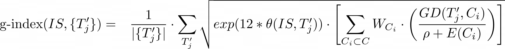

## Definitions
### `g-index` :
A measure of intelligence defined as average of `TC` across all `tasks_scope`.

### `Intelligent System (IS)` : 
The `Intelligent System (IS)` generates a `Skill Program (P)` when input the specification for a given task `T'`. The formulation here is method-agnostic, and allows the g-index benchmark to extend to any new techniques in the future.
### `Task (T)`: 
A natural language prompt that forms an instruction to the machine what to do.
### `Skill Program (S)`: 
A program or DAG generated by an `IS` to perform task `T'`
### `Curricula (C)`: 
Data that the `IS` uses to train itself is denoted by `C` or Curricula, in our case all data in the train_array
### `Curriculum Domain (C i)` :
Refers to a subset of C where all tasks T ∈ C i belong to the same task domain.
### `Domain (D)` : 
TODO
### `Divergence Score (DS)` : 
TODO
### `Performance Theta (θ)` : 
TODO
### `Domain Distance Score (DD)` : 
Fractional node divergence between any two given domains.
### `Generalization Difficulty (GD)` : 
`DS` between task domain & curricula domain.SSS
### `P(C_n)` : 
Probability of finding curricula of domain type `C_i` in curricula. or (`samples_of_domain_C_i`/`total_number_C_samples`)
### `Priors (P)` : 
Information which is built into the `IS` _before_ training. This is negligible (~0) for most of current models.
### `Experience (E)` : 
Compute ( in `FLOPS` or `MIPS` ) used to train the `IS` on the curricula `C`
### `Task Contribution (TC)` : 
Contribution of performance on one `task (T)` to the overall `g_index`  this is equal to, for any domain `C_i` in total n domains in curricula `C`  = `θ * Σ (P(C_i) * ( (GD(T,C_n)/(P + E(C_i)) )))`
### `Tasks Scope` or `Task Domains`: 
TODO